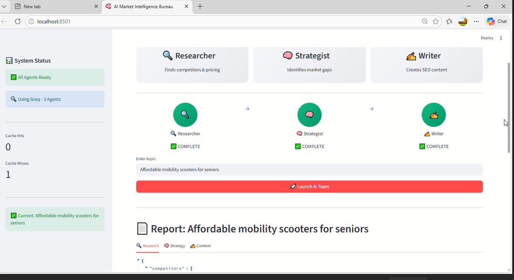

# 🧠 AI Market Intelligence Bureau

<div align="center">

**Multi-Agent AI System | Competitor Analysis | Content Strategy | Groq Powered**

</div>

---

## 🚀 What Does This Do?

Your AI team of **3 specialized agents** works together to deliver market intelligence in minutes:

| Agent | Role | Output |
|-------|------|--------|
| 🔍 **Researcher** | Finds competitors, pricing, UVPs, reviews | `research.json` |
| 🧠 **Strategist** | Identifies market gaps & opportunities | `strategy.md` |
| ✍️ **Writer** | Creates SEO content, social posts, emails | `content.md` |

**What used to take hours now takes minutes.**

---

## ✨ Features

- **3 Specialized Agents** – Researcher → Strategist → Writer
- **Semantic Cache** – Reduces API costs by 60% for repeated queries
- **Real-time Pipeline Visualization** – Watch agents turn from pending → active → complete
- **Professional Reports** – JSON research, Markdown strategy & content
- **Free to Run** – Uses Groq's free tier

---

## 🛠️ Tech Stack

| Category | Technology |
|----------|------------|
| Agent Orchestration | CrewAI |
| LLM | Groq (Llama 3.1 8B) |
| Web Search | Tavily API |
| Frontend | Streamlit |
| Cache | ChromaDB |

---

## 📋 Prerequisites

- Python 3.10+
- API Keys (free):
  - [Groq API Key](https://console.groq.com)
  - [Tavily API Key](https://app.tavily.com)

---

## 🚀 Quick Start

### 1. Clone Repository

```bash
git clone https://github.com/yourusername/ai-market-intelligence.git
cd ai-market-intelligence
```

### 2. Install Dependencies

```bash
pip install pipenv
pipenv install
```

### 3. Set Up API Keys

Create a `.env` file:

```env
GROQ_API_KEY=gsk_your-key-here
TAVILY_API_KEY=tvly_your-key-here
```

### 4. Run Application

```bash
pipenv shell
streamlit run app.py
```

Open `http://localhost:8501`

---

## 📁 Project Structure

```
ai-market-intelligence/
├── app.py                 # Streamlit frontend
├── backend/
│   ├── crew.py           # CrewAI orchestration
│   ├── agents/
│   │   ├── researcher.py
│   │   ├── strategist.py
│   │   └── writer.py
│   ├── tasks/
│   │   ├── research_task.py
│   │   ├── strategy_task.py
│   │   └── content_task.py
│   └── tools/
│       ├── semantic_cache.py
│       └── token_tracker.py
├── output/               # Generated reports
├── .env                  # API keys
└── README.md
```

---

## 🎯 How It Works

1. **Enter Topic** – e.g., "Eco-friendly electric wheelchairs"
2. **Researcher** – Searches web for competitors, pricing, reviews
3. **Strategist** – Analyzes gaps, opportunities, SWOT
4. **Writer** – Creates blog ideas, SEO keywords, social posts
5. **Download Reports** – JSON and Markdown files ready to use

---

## 📊 Sample Output

**research.json**

```json
{
  "competitors": [
    {"name": "Pride Mobility", "price": "$3,700", "usp": "Lightweight carbon fiber"},
    {"name": "Karman Healthcare", "price": "$2,500", "usp": "Foldable design"}
  ]
}
```

**strategy.md**

```markdown
## Market Gaps
- No budget-friendly lightweight options
- Limited all-terrain models

## Opportunities
- Launch affordable foldable chair
- Create eco-friendly battery line
```

---

## 🔧 Troubleshooting

| Issue | Solution |
|-------|----------|
| Rate limit errors | Add delays in `crew.py` or use smaller model |
| No output files | Check API keys in `.env` |
| Pipeline not updating | Refresh browser after run |

---
## 📺 Project Demo walkthrough
Click the image below to watch the full project execution on Google Drive:

[](https://drive.google.com/file/d/1Jb8Vwm8EGCQtRToHIuTnaxrKllVq6RjL/view?usp=sharing)


## 📄 License

MIT

---

## 🙏 Acknowledgments

- [CrewAI](https://github.com/joaomdmoura/crewAI) – Multi-agent framework
- [Groq](https://groq.com) – Free LLM API
- [Tavily](https://tavily.com) – Web search API
- [Streamlit](https://streamlit.io) – UI framework

---

<div align="center">

**Built with ❤️ using CrewAI + Groq | 3-Agent System**

</div>
